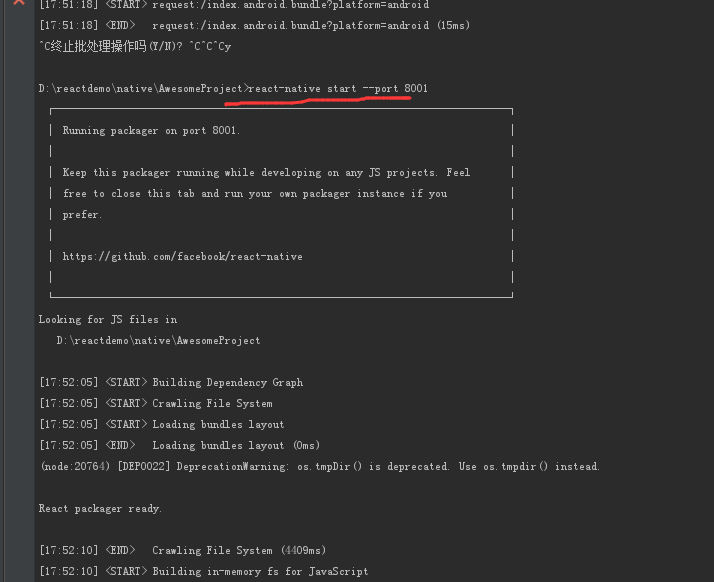
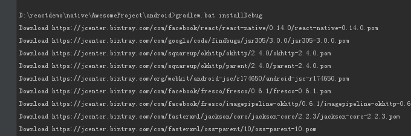
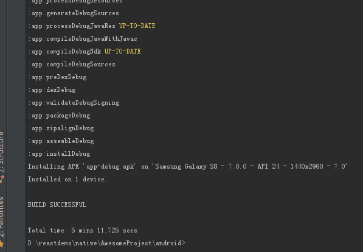
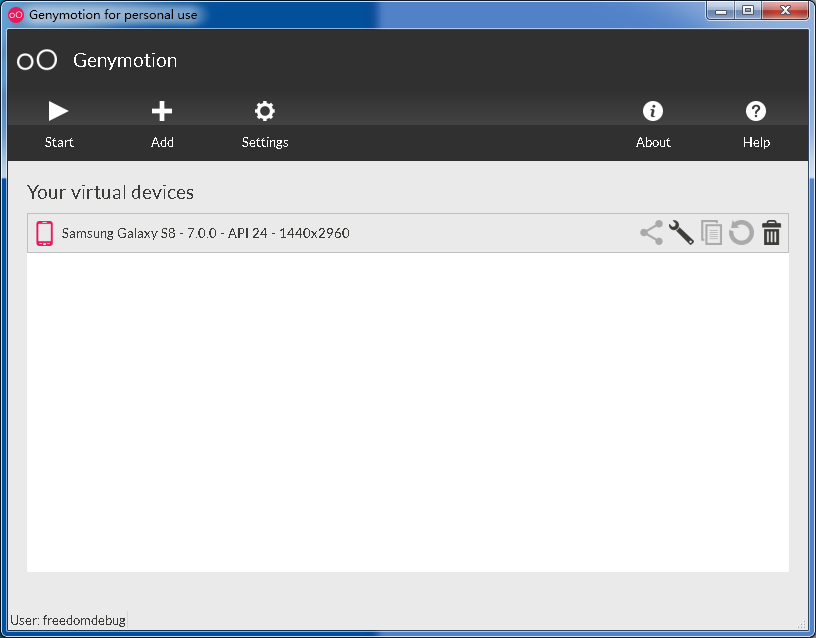
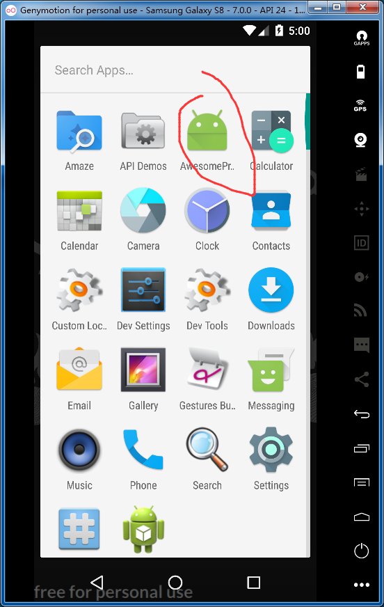
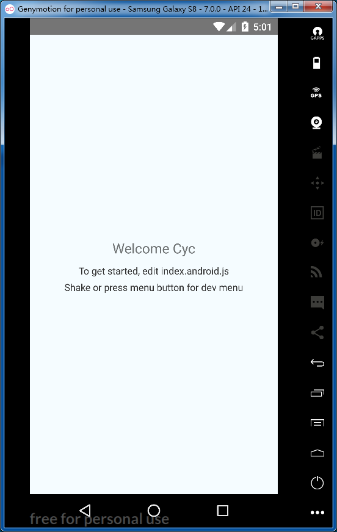
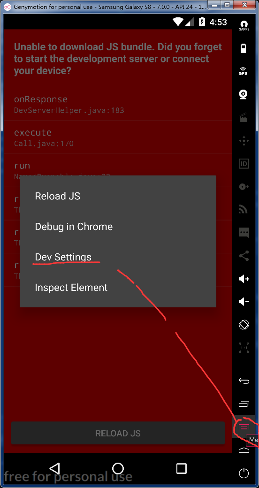
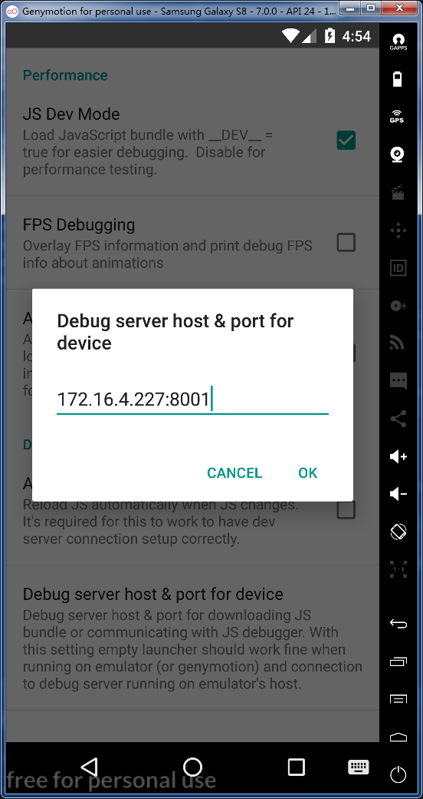

# AwesomeProject 
    https://www.jianshu.com/p/3d716097fe08
    常见问题http://facebook.github.io/react-native/docs/troubleshooting.html
    一个测试项目
    https://www.cnblogs.com/aichenxy/p/5971613.html
    下载IDE
    http://www.android-studio.org/

## 启动
1.启动网站

    react-native start --port 8001
    如下图

注意：此处端口经常被占用报错，换一个或释放占用即可

2.打包程序

    D:\reactdemo\native\AwesomeProject\android>gradlew.bat installDebug
    如下图

3.开启Genymotion中的设备

## 问题1：react-native报错SDK location not found

    http://blog.csdn.net/u012764110/article/details/62229407
    SDK location not found. Define location with sdk.dir in the local.properties file or with an ANDROID_HOME environment variable

    解决：不行
    从androidStudio根目录中，复制一份local.properties到react-native项目根目录中

    解决：可以，设置
    在Android下新建local.properties，里面
    sdk.dir = C\:\\Users\\admin\\appdata\\Local\\Android\\sdk
    http://www.itkeyword.com/doc/6491412187106621x766/react-native-android-build-failed

## 问题2 unable to download js bundle

    在线浏览器中输入：http://172.16.4.227:8001/index.android.bundle?platform=android
    然后react-native start --port 8001窗口会加载
    在Android中点击菜单，设置debug选项设置ip
    如下图

